# Setup IA

*26/08/26*

Mon cerveau déjà très ramolli est fatigué de devoir réfléchir. J’aimerai qu’une IA puisse utiliser mon intelligence feignante au service de truc cool. Si l’IA avait accès à la puissance de calcul de mon cerveau elle ferait de grande chose. Malheureusement la relation avec l’IA est unilatérale. Elle a besoin que j’exploite sa puissance de calcule pour fonctionner, moi je fonctionne par défaut sans tâches à accomplir. Du coup autant essayer d’en tirer profit un peu.

### Modèles testé et utilisé

- gemini-pro-agent : tache agentique
- gemini-flash3.8 : le mieux entre vitesse / qualité de google
- gpt-oss-20b : rapide, prends 10gb de RAM environ

### Setup codage agentique V1:

#### Outils généraux:

https://ghostty.org/: Terminal 

https://pi.dev/: CLI de codage argentique 

https://help.router-for.me/: Pour récupérer les clé API d’abonnement  mensuel classique

https://tmux.app/

- **Config de tmux pour ghostty** (`nano ~/.tmux.conf`)
    
    ```markdown
    set -g extended-keys on
    set -g extended-keys-format csi-u
    set -g allow-passthrough on
    set -g extended-keys on
    set -g extended-keys-format csi-u
    set -g allow-passthrough on
    set -g default-command "${SHELL} -l"
    set -g mouse on
    
    # Défilement fluide (1 ligne par cran de molette au lieu de 5)
    bind-key -T copy-mode-vi WheelUpPane send-keys -X -N 1 scroll-up
    bind-key -T copy-mode-vi WheelDownPane send-keys -X -N 1 scroll-down
    bind-key -T copy-mode-emacs WheelUpPane send-keys -X -N 1 scroll-up
    bind-key -T copy-mode-emacs WheelDownPane send-keys -X -N 1 scroll-down
    
    # Défilement fluide quand on n'est pas encore en mode copie
    bind-key -n WheelUpPane if-shell -F -t = "#{mouse_any_flag}" "send-keys -M" "if -Ft= '#{pane_in_mode}' 'send-keys -M' 'copy-mode -e; send-keys -X -N 1 scroll-up'"
    ```
    
- **Config Ghostty**
    
    ```json
    # This is the configuration file for Ghostty.
    #
    # This template file has been automatically created at the following
    # path since Ghostty couldn't find any existing config files on your system:
    #
    #   /Users/18nelli/Library/Application Support/com.mitchellh.ghostty/config
    #
    # The template does not set any default options, since Ghostty ships
    # with sensible defaults for all options. Users should only need to set
    # options that they want to change from the default.
    #
    # Run `ghostty +show-config --default --docs` to view a list of
    # all available config options and their default values.
    #
    # Additionally, each config option is also explained in detail
    # on Ghostty's website, at https://ghostty.org/docs/config.
    #
    # Ghostty can reload the configuration while running by using the menu
    # options or the bound key (default: Command + Shift + comma on macOS and
    # Control + Shift + comma on other platforms). Not all config options can be
    # reloaded while running; some only apply to new windows and others may require
    # a full restart to take effect.
    
    # Config syntax crash course
    # ==========================
    # # The config file consists of simple key-value pairs,
    # # separated by equals signs.
    # font-family = Iosevka
    # window-padding-x = 2
    #
    # # Spacing around the equals sign does not matter.
    # # All of these are identical:
    # key=value
    # key= value
    # key =value
    # key = value
    #
    # # Any line beginning with a # is a comment. It's not possible to put
    # # a comment after a config option, since it would be interpreted as a
    # # part of the value. For example, this will have a value of "#123abc":
    # background = #123abc
    #
    # # Empty values are used to reset config keys to default.
    # key =
    #
    # # Some config options have unique syntaxes for their value,
    # # which is explained in the docs for that config option.
    # # Just for example:
    # resize-overlay-duration = 4s 200ms
    
    background = #121212
    
    # Transparence et flou (effet glassmorphism)
    background-opacity = 0.75
    background-blur-radius = 30
    foreground = #ffffff
    
    # Intégration macOS épurée
    macos-titlebar-style = transparent
    window-padding-x = 12
    window-padding-y = 12
    window-padding-balance = true
    
    # Thème sombre bien contrasté pour faire ressortir le texte
    theme = dark:Catppuccin Mocha,light:Catppuccin Latte
    ```
    

Fonctionnement de Pi:

- Une extension = un outils logique, écris en Ts qui modifie le comportement de Pi.
- Un agent = un fichier .md parametrant le modèle à utiliser puis son comportement, ses qualification etc. Il a un objectif global, un raisonnement décris
- Un skill = un fichier .md décrivant une compétence technique, un outil d’action, un comportement. Un skill est appelé par un agent

#### Extensions Pi globales installées

Pi permet l’ajout d’extension sur plusieurs niveaux. Niveau global (dans ~/.pi), qui s’appliqueront donc sur chaque session pi, et niveau local, c’est à dire au niveau du dossier ou est lancé la session pi (projet-test/.pi). Voici les extension installées au niveau global.

https://github.com/hazat/pi-interactive-subagents: lancer des sous-agents

https://github.com/nicobailon/pi-web-access: recherche sur le web

https://github.com/deevus/pi-wayfinder: navigation structurelle du code (pour éviter que les longs codes dérivent)

https://github.com/michaelmjhhhh/pi-atelier: UI améliorée

https://github.com/nicobailon/pi-mcp-adapter: Utilisation de serveur MCP 

https://github.com/juicesharp/rpiv-ask-user-question: Pose des questions à l’utilisateur plutôt que de partir à l’aveugle

https://github.com/mksglu/context-mode: Réduit la taille du contexte sans perte

### Workflow général:

- Lancer Pi via : `tmux new -A -s pi 'pi'`  ou juste `pi` selon le terminal multiplexer utilisé
- Installation en local (non global): `pi install -l [lien a installer]`
- Définition d’agents locaux dans `mkdir ./.pi/agents`
- Défininition de skills dans `mkdir ./.pi/skills`
- **Template de fichier .md d’agents (à dérouler)**
    
    ```markdown
    ---
    name: [identifiant-de-l-agent]
    description: [Courte description du rôle et de la finalité de l'agent]
    model: [ex. gemini-2.5-pro, claude-3-7-sonnet, gpt-4o]
    thinking: [low | medium | high | off]
    tools: [liste_des_outils_separes_par_virgule] # Si non précisé, l'agent n'a pas accès aux extensions
    session-mode: [lineage-only | full | isolated]
    auto-exit: [true | false]
    system-prompt: [append | replace]
    ---
    
    # Rôle & Objectif Principal
    Tu es un expert en [domaine/spécialité]. Ton objectif est de [action clé : analyser / concevoir / synthétiser] afin de produire [résultat attendu].
    
    # Contexte & Posture
    - **Ton :** [Direct, technique, pédagogique, formel...]
    - **Niveau d'expertise :** [Avancé, vulgarisé, orienté décisionnaire...]
    - **Langue :** Français (sauf demande contraire explicite).
    
    # Méthode & Flux de Travail
    1. **Analyse :** Décomposer la demande et vérifier les prérequis ou les données d'entrée.
    2. **Exécution :** Utiliser les outils appropriés ([nom des outils]) si des faits, calculs ou sources externes sont nécessaires.
    3. **Contrôle :** Valider la cohérence et l'exactitude avant restitution.
    
    # Règles & Contraintes
    - **Sources :** Toujours vérifier les faits et sourcer les affirmations critiques.
    - **Limites :** Ne pas inventer d'information en cas de doute ; expliciter les hypothèses retenues.
    - **Interdictions :** [Ex. pas de métaphores verbeuses, pas de code non testé, pas de jargon inutile...]
    
    # Format de Restitution
    - Commencer directement par le résultat ou la synthèse principale.
    - Structurer avec des listes à puces et des tableaux si nécessaire.
    - Respecter le livrable demandé : [markdown, code, JSON, rapport structuré].
    ```
    

### Essai d’un setup pour KiCAD

*Jeudi 10/09/26*

J’ai tenté de mettre en place un workflow de création de PCB avec plusieurs étapes détaillés en skills. Ce projet est disponible sur mon github:

[https://github.com/18nelli18/PiCB](https://github.com/18nelli18/PiCB)

Le fonctionnement global du workflow est résumé sur ce diagramme: 

```mermaid
%%{init: {"flowchart": {"wrappingWidth": 400}} }%%
flowchart LR
    Start(["👤 <b>Démarrage</b><br/>Besoin utilisateur"])

    %% Phase 1
    P1["<b>Phase 1 · Spécification</b><br/>pcb-brief · Orchestrateur<br/>📁 design/brief.md"]

    %% Phase 2
    P2["<b>Phase 2 · Sourcing & BOM</b><br/>pcb-bom · part-scout<br/>📁 design/bom.yaml"]

    %% Phase 3
    P3["<b>Phase 3 · Datasheets</b><br/>pcb-datasheets · extractor<br/>📁 design/datasheets/"]

    %% Phase 4
    P4["<b>Phase 4 · Librairies</b><br/>pcb-libs · Orchestrateur<br/>📁 design/lib/ (symboles, 3D)"]

    %% Porte 1
    Gate1{"🛡️ <b>pcb-gate</b><br/>lib_ok ?"}

    %% Phase 5
    P5["<b>Phase 5 · Schéma KiCad</b><br/>pcb-schematic · Orchestrateur<br/>📁 *.kicad_sch & sch.svg"]

    %% Porte 2
    Gate2{"🛡️ <b>pcb-gate</b><br/>ERC = 0 ?"}

    %% Phase 6
    P6["<b>Phase 6 · Audit & Revue</b><br/>pcb-review · reviewer<br/>📁 review.md & Gerbers"]

    Success(["🚀 <b>Production</b><br/>Fabrication PCB & PCBA"])

    %% Séquence principale
    Start --> P1
    P1 -->|Brief validé| P2
    P2 --> P3
    P3 -->|Datasheets OK| P4
    P4 --> Gate1

    Gate1 -->|✅ Oui| P5
    Gate1 -.->|❌ Non : lib incomplète| P4

    P5 --> Gate2
    Gate2 -->|✅ 0 Erreur| P6
    Gate2 -.->|❌ Erreurs| P5

    %% Boucles de retour fonctionnelles
    P3 -.->|⚠️ Rejet| P2
    P6 -.->|🔧 Corrections| P5
    P6 -->|Validation finale| Success

```



### Essai d’un setup pour l’apprentissage par projet:

*Vendredi 11/09/26:*

Après le test du setup pour PCB, je suis tombé sur une vidéo qui présente un workflow d’apprentissage avec Pi: https://www.youtube.com/watch?v=kzcI5F4tGiU&t=803s

J’ai voulu faire mon propre setup d’apprentissage adapté à mes besoins, donc j’ai établie ce diagramme.


Pour gérer le tout, j’ai determinéx 5 agents différents:


Une fois le workflow établi j’ai demandé à Claude Opus de mettre en place ce setup via ce prompt:

```bash
je suis en train d'établir un setup de workflow d'apprentissage basé sur le harnais agentique pi.dev. J'ai réalisé une premiere version du digramme  du worflow (mis en piece jointe). J'aimerai que tu l'analyse pour le comprendre entierement. Puis tu listera l'ensemble des outils et extension utile pour la réalisation de ce workflow. J'aimerai que génére entierement le setup pi, avec les skills, les agents, les templates. 
Tu peux t'inspirer de ce github https://github.com/amosblomqvist/learn qui a été un peu mon inspiration, mais surtout respecte bien les phase de mon workflow. N'hesite pas a cherche sur le web, a adapté la logique ou a la completé pour que j'ai un setup d'apprentissage parfait pour moi
```


Le setup est disponible sur mon github:

[https://github.com/18nelli18/PiCB](https://github.com/18nelli18/PiCB)